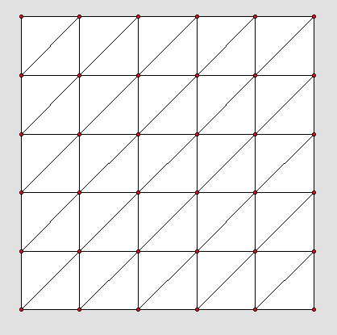
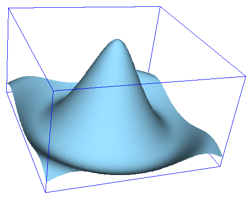
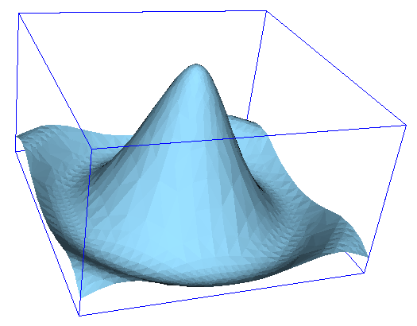
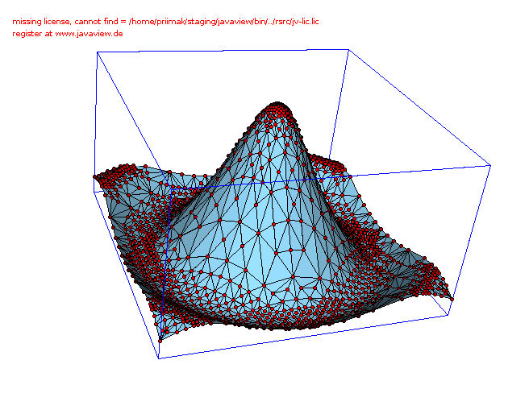

Adaptive mesh refinement for XY->Z problems
=========================================

Overview
--------

When performing numerical simulations one often deals with need to calculate certain
values for each point in the predefined grid on XY plane, which typically looks like 
this 
<br/>
<center>

</center>
<br/>
As a result of such
calculation a 2D surface is formed in the X-Y-Z space. For example, the X axis might
correspond to applied voltage and Y axis to temperature and calculated value might be
current. More often than not, such surface have large smooth regions and small regions
where it is bending precipitously ( has high curvature ). If a simple rectilinear
grid of X and Y parameters is used to drive calculations then to capture features of
regions with high curvature one has to use, often, very fine mesh. Here is an example of
calculating for the following function
```ruby
Math::cos(x**2+y**2)/(x**2+y**2+0.5)
```
For the mesh shown above, for X and Y changing from -2 to 2 and 36 vertexes in total
<br/>
<center>

</center>
<br/>
That is very rough, however there are just a couple of regions where we need the fine 
mesh here. Here is an example of how it looks with the fine mesh.
<br/>
<center>

</center>
<br/>
This however required 10,000 vertexes.
However what is
really needed is to tip-toe over regions that are strongly bending and make just a
few computations in the smooth regions. Additionally we want such procedure to be
fully automated. So that we can start with very rough grid and let separate program
add new points to the grid as necessary to make it as smooth as some predefined value.
And this is exactly what this ruby package does. Here is what it can archive starting 
from 10 by 10 grid.
<br/>
<center>

</center>
<br/>
This is pretty smooth. And here is the grid with vertexes.
<br/>
<center>

</center>
<br/>
You can see that vertexes cluster right they need to be to expose essential features 
of the surface and most importantly it required only 1423 vertexes. 

Algorithm
---------

TO BE WRITTEN

Installation
------------

TO BE WRITTEN

Usage
-----

TO BE WRITTEN
