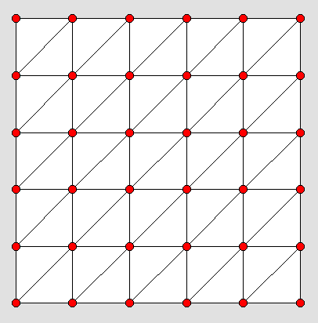

Adaptive mesh refinement for XY->Z problems
=========================================

Overview
--------

When performing numerical simulations one often deals with need to calculate certain
values for each point in the predefined grid on XY plane. 
 

As a result of such
calculation a 2D surface is formed in the X-Y-Z space. For example, the X axis might
correspond to applied voltage and Y axis to temperature and calculated value might be
current. More often than not, such surface have large smooth regions and small regions
where it is bending precipitously ( has high curvature ). If a simple rectilinear
grid of X and Y parameters is used to drive calculations then to capture features of
regions with high curvature one has to use, often, very fine mesh. However what is
really needed is to tip-toe over regions that are strongly bending and make just a
few computations in the smooth regions. Additionally we want such procedure to be
fully automated. So that we can start with very rough grid and let separate program
add new points to the grid as necessary to make it as smooth as some predefined value.
And this is exactly what this ruby package does. 

Algorithm
---------

TO BE WRITTEN

Installation
------------

TO BE WRITTEN

Usage
-----

TO BE WRITTEN
